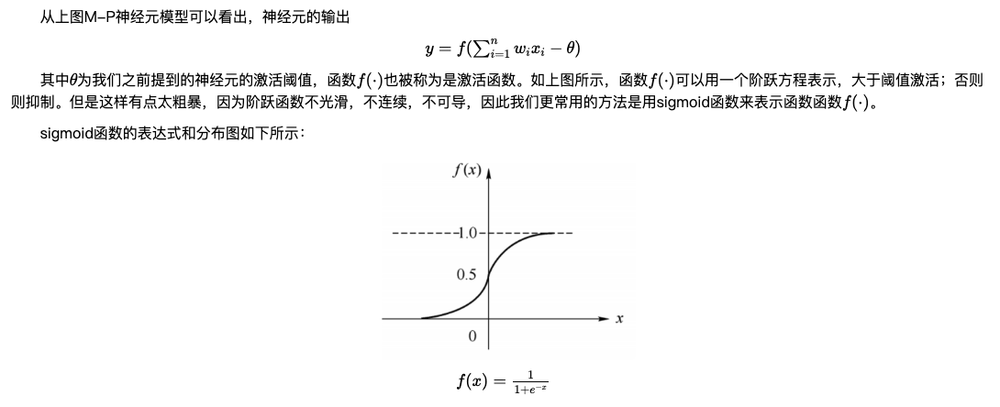
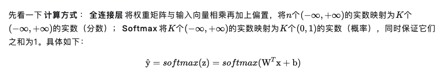
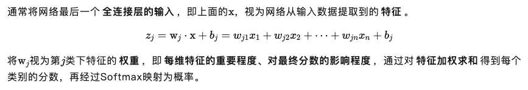

## 深度学习理论（DL）

### 1.基本概念

- **神经元（感知器）：**

  神经元是神经网络的基本单元，**神经元有两种状态：兴奋和抑制**。一般情况下，大多数的神经元是处于抑制状态，但是一旦某个神经元收到刺激，导致它的电位超过一个阈值，那么这个神经元就会被激活，处于“兴奋”状态，进而向其他的神经元传播化学物质（其实就是信息）。下图是一个**人工神经元模型**（M-P神经元模型）。

  

  

- **神经网络**

  通常将多层感知机这样的多层结构称之为是神经网络。

  

- **误差逆传播算法（BP算法）**——神经网络的学习算法

  所谓神经网络的训练或者是学习，其主要目的在于**通过学习算法得到神经网络解决指定问题所需的参数**，这里的参数包括各层神经元之间的连接权重以及偏置等。我们通常是根据实际问题来构造出网络结构，参数的确定则需要神经网络通过**训练样本和学习算法来迭代找到最优参数组。**

  

  **步骤：**先将输入实例提供给输入层神经元，然后逐层将信号前传，直到产生输出层的结果；然后计算输出层的误差，再将误差逆向传播至隐层神经元；最后根据隐层神经元的误差来对连接权和阈值进行调整，该迭代过程循环进行，直到达到某些停止条件位置（如训练误差已达到一个很小的值）。
  
  
  
- batch_size = 小训练的样本数量，完成一个batch_size 的训练代表进行了一个iteration，若将所有样本都进行训练了一次，则进行了一个epoch（包含若干个iterationp），

- 1

### 2.卷积神经网络CNN

- **卷积神经网络**

  使用全连接网络的话，代价太大了（28 *  28 *  1 的图片输入到 隐藏层15个 输出层10个的全连接神经网络中，一共需要优化28 *  28 *  15  *  10 + 15 + 10 = **117625**个参数）。

  那么不全连接的话，就可以**减少参数个数**（理论依据：查找局部特征就可以进行分类了，譬如我们看一张猫的图片，可能**看到猫的眼镜或者嘴巴就知道这是张猫片**，而不需要说每个部分都看完了才知道，啊，原来这个是猫啊。所以如果我们可以用某种方式对一张图片的**某个典型特征识别，那么这张图片的类别**也就知道了。）

  

- **卷积层**（conv）

  4 * 4 的图像，运用两个 2 * 2 的卷积核进行计算，步长为1，即每次以 2 * 2 的固定窗口往右滑动一个单位。以第一个卷积核filter1为例，计算过程如下：

  ```
  1 feature_map1(1,1) = 1*1 + 0*(-1) + 1*1 + 1*(-1) = 1 
  2 feature_map1(1,2) = 0*1 + 1*(-1) + 1*1 + 1*(-1) = -1 
  3 ``` 
  4 feature_map1(3,3) = 1*1 + 0*(-1) + 1*1 + 0*(-1) = 2
  ```

  **feature_map尺寸计算公式：[ (原图片尺寸 -卷积核尺寸)/ 步长 ] + 1**

  

  

- **卷积核**（特征提取器，不同的卷积核负责提取不同的特征）（其他领域也叫滤波器）

  通过第一个卷积核计算后的feature_map是一个三维数据，在第三列的绝对值最大，说明原始图片上对应的地方有一条垂直方向的特征，即像素数值变化较大；而通过第二个卷积核计算后，第三列的数值为0，第二行的数值绝对值最大，说明原始图片上对应的地方有一条水平方向的特征。

  

  **一般会在越靠近输入层的卷积层设定少量的卷积核，越往后，卷积层设定的卷积核数目就越多。**

  

- **池化层**（max pooling、average pooling）

  通过上一层2 * 2的卷积核操作后，我们将原始图像由4 * 4的尺寸变为了3 * 3的一个新的图片。**池化层的主要目的是通过降采样的方式，在不影响图像质量的情况下，压缩图片，减少参数。**简单来说，假设现在设定池化层采用MaxPooling，大小为2 * 2，步长为1，取每个窗口最大的数值重新，那么图片的尺寸就会由3 * 3变为2 * 2：(3-2)/1+1=2。从上例来看，会有如下变换：

  

- **补零层**

   所以到现在为止，我们的图片由4 * 4，通过卷积层变为 3 * 3，再通过池化层变化 2 * 2，如果我们再添加层，那么图片岂不是会越变越小？这个时候我们就会引出“Zero Padding”（补零），它可以**帮助我们保证每次经过卷积或池化输出后图片的大小不变**，如，上述例子我们如果加入Zero Padding，再采用3*3的卷积核，那么变换后的图片尺寸与原图片尺寸相同，如下图所示：

  

  通常情况下，我们希望图片做完卷积操作后保持图片大小不变，所以我们一般会选择尺寸为 3 * 3的卷积核和 1 的zero padding，或者 5 * 5的卷积核与 2 的zero padding，这样通过计算后，可以保留图片的原始尺寸。那么**加入zero padding后的feature_map尺寸 =( width + 2 * padding_size - filter_size )/stride + 1**

  

- **Flatten层 & Fully Connected Layer**

  做完Max Pooling后，我们就会把这些数据“拍平”，丢到Flatten层（该层的作用就是拍平并容纳所有特征，），然后把Flatten层的output放到full connected Layer里，采用softmax对其进行分类。

  

  full connected Layer（全连接层）和softmax怎么运作：

  

  

  

  

  该图片属于每一类的概率之和为1，选择最大的即可（softmax归一化数值为概率，且各类概率之和为1）

  

- 22


### 3.循环神经网络RNN

既然我们已经有了人工神经网络和卷积神经网络，为什么还要循环神经网络？原因很简单，无论是卷积神经网络，还是人工神经网络，他们的前提假设都是：元素之间是相互独立的，输入与输出也是独立的。循环神经网络的本质是**：像人一样拥有记忆的能力。**因此，**他的输出就依赖于当前的输入和记忆。**用一句话解释RNN，就是**一个单元结构重复使用**。

- **网络结构：**

  

  

  如果把上面有W的那个带箭头的圈去掉，它就变成了最普通的**全连接神经网络**。x是一个向量，它表示**输入层**的值（这里面没有画出来表示神经元节点的圆圈）；s是一个向量，它表示**隐藏层**的值（这里隐藏层面画了一个节点，你也可以想象这一层其实是多个节点，节点数与向量s的维度相同）；

  U是输入层到隐藏层的**权重矩阵**，o也是一个向量，它表示**输出层**的值；V是隐藏层到输出层的**权重矩阵**。

  那么，现在我们来看看W是什么。**循环神经网络**的**隐藏层**的值s不仅仅取决于当前这次的输入x，还取决于上一次**隐藏层**的值s。**权重矩阵** W就是**隐藏层**上一次的值作为这一次的输入的权重。

- 2

  


### 4.长短期记忆网络LSTM

- 

  


